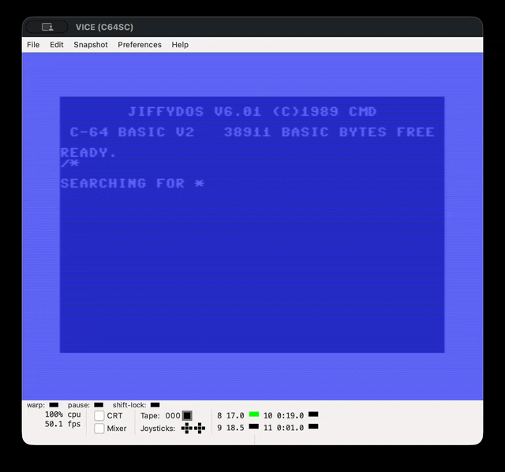

# Moria8

Moria8 is a port of the classic roguelike game, Moria, for 8-bit platforms
written in platform-specific assembly. Current releases target the Commodore 64
and Commodore 128, with additional 8-bit ports planned.



## Port Status

| Platform | Status | Download |
| -------- | ------ | -------- |
| Commodore 64 (C64) | Released ([notes](docs/release_notes/commodore.md)) | [moria8-c64.d64](https://github.com/dcgibbons/moria8/releases/download/v1.0.0/moria8-c64.d64) |
| Commodore 128 (C128) | Released ([notes](docs/release_notes/commodore.md)) | [moria8-c128.d71](https://github.com/dcgibbons/moria8/releases/download/v1.0.0/moria8-c128.d71) |
| Commodore Plus/4 | In Progress | |
| Commodore PET | Maybe | |
| Commodore VIC-20 | Maybe | |
| Commander X16 | Planned | |
| Acorn BBC Master | Planned | |
| Apple II | Planned | |
| Apple IIgs | Planned | |
| Atari 8-bit | Planned | |
| CP/M (Z80) | Planned | |
| MSX | Planned | |
| Nintendo Entertainment System | Planned | |
| ZX Spectrum | Planned | |

Release notes describe the current feature set, known limits, and
platform-specific behavior for each target.

See the [Cross Platform Strategy](docs/CROSS_PLATFORM_STRATEGY.md) for more
details on upcoming ports.

## Building from Source

### Requirements

- macOS or Linux host
- `make`
- Java, for Kick Assembler
- VICE (`x64sc`, `x128`, and `c1541`)
- Python 3 for build and test helper scripts

Kick Assembler is downloaded into `tools/kickass/` by the makefiles on first
use. To use an existing jar, pass `KICKASS=/path/to/KickAss.jar`.

VICE tool paths can be overridden through make variables when needed, for
example `make run VICE=/path/to/x64sc`.

### Build

```sh
make
make build
make disk64
make disk128
```

`make` and `make build` will build the entire project for all platforms.
`make disk64` and `make disk128` will build the disk images for c64 and c128,
respectively.

Disk images are emitted under `commodore/out/`:

- `commodore/out/moria8-c64.d64`
- `commodore/out/moria8-c128.d71`

### Run

```sh
make run
make run64
make run128
```

`make run` and `make run64` launch the C64 disk. `make run128` launches the
C128 disk.

### Test

```sh
make test
make test128-fast
make test128-fast-smoke
make test128
```

`make test` runs the default regression mix. `make test128-fast` is the fast
C128 unit batch, `make test128-fast-smoke` covers high-value C128 runtime boot
and town paths, and `make test128` is the broader C128 shell harness.

## Documentation

- [Player Manual](docs/MANUAL.md)
- [Monster Reference](docs/MONSTERS.md)
- [Spell And Prayer Reference](docs/SPELLS.md)
- [Player Guide](docs/PLAYER_GUIDE.md)
- [Development Process](docs/DEVELOPMENT_PROCESS.md)
- [Design Reference](docs/DESIGN.md)
- [Architecture Reference](docs/ARCHITECTURE.md)
- [Cross Platform Strategy](docs/CROSS_PLATFORM_STRATEGY.md)
- [Internal Mandates](docs/INTERNAL_MANDATES.md)
- [Release Checklist](docs/RELEASE_CHECKLIST.md)
- [Backlog](docs/BACKLOG.md)

## Credits

The Dungeons of Moria is a single player dungeon simulation originally written
by Robert Alan Koeneke, with its first public release in 1983. The game was
originally developed using VMS Pascal as
[VMS Moria](https://github.com/dungeons-of-moria/vms-moria) before being
ported to the C language by James E. Wilson in 1988, and released as
[Umoria](https://github.com/dungeons-of-moria/umoria).

Moria8 is developed by [Chad Gibbons](https://github.com/dcgibbons).

## License Information

Moria8 is released under the [GNU General Public License v3.0](LICENSE).
